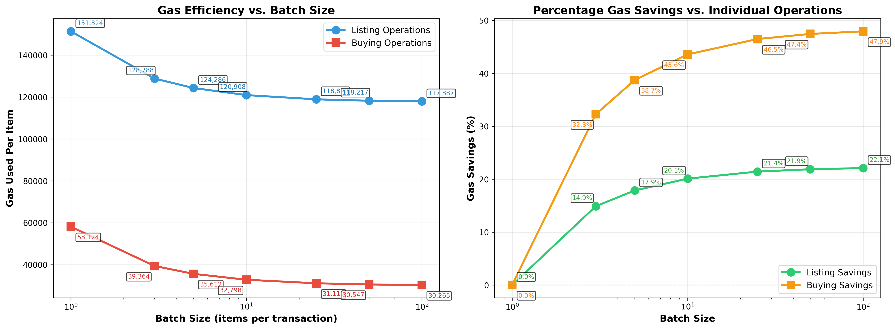
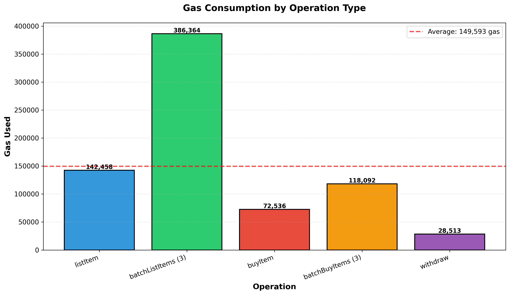
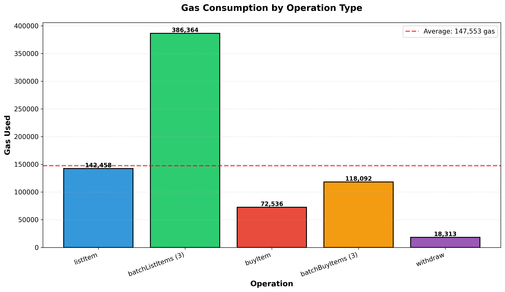
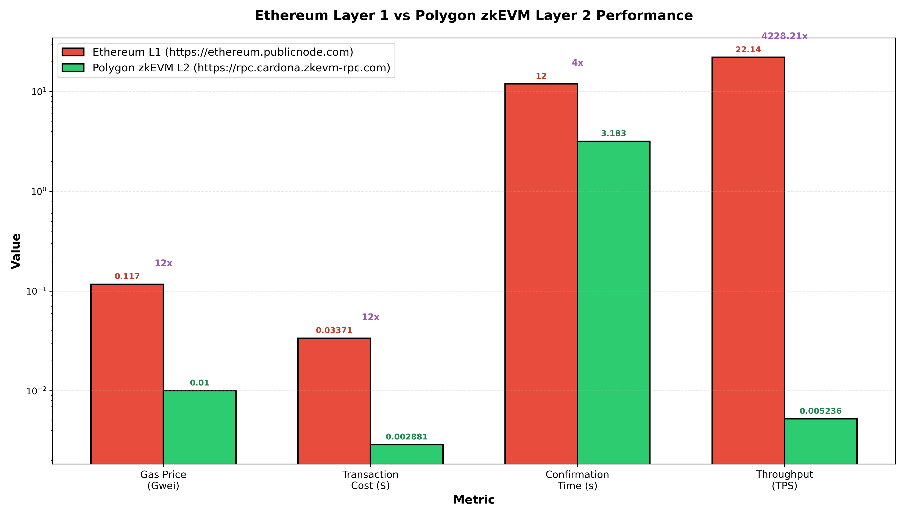

# ScalableMarketplace

A **proof-of-concept blockchain-based marketplace** optimized for **zkEVM and Layer 2 solutions**. Demonstrates scalability patterns through batch operations, efficient data structures, and off-chain indexing to minimize gas and maximize throughput on Ethereum-compatible blockchains.

## Key Features

- [x] **Batch Operations**: List and buy items individually or in batches (up to 100 per transaction)
- [x] **Gas Optimized**: 58% cheaper per-item costs for bulk purchases; 17% savings for bulk listings
- [x] **Off-Chain Indexing**: Event emission for The Graph and indexing services
- [x] **Safe Payments**: Seller balance tracking with secure withdrawals
- [x] **Benchmarking Built-in**: Measure gas and performance across batch sizes
- [x] **React Frontend**: Web interface for marketplace interaction

## Architecture

The smart contract implements proven Layer 2 scalability patterns:

| Pattern                | Implementation                                                              |
| ---------------------- | --------------------------------------------------------------------------- |
| **Batch Operations**   | `batchListItems()`, `batchBuyItems()`, `batchGetItems()` (max 100 items/tx) |
| **Efficient Storage**  | Mappings over arrays for O(1) lookups                                       |
| **Off-Chain Indexing** | Events (`ItemListed`, `ItemSold`, `BatchProcessed`) for The Graph           |
| **Payment Handling**   | Seller balance tracking + safe withdrawals                                  |

## Project Structure

```text
ScalableMarketplace/
├── contracts/
│   └── ScalableMarketplace.sol      # Main smart contract
├── scripts/
│   ├── deploy.js                     # Deployment script
│   ├── benchmark.js                  # Performance benchmarking
│   └── copy-abi.js                   # ABI export script
├── test/
│   └── ScalableMarketplace.js        # Test suite (Chai + Hardhat)
├── frontend/
│   ├── src/
│   │   ├── App.jsx                   # Main React component
│   │   ├── hooks/
│   │   │   ├── useWeb3.js            # Web3 wallet integration
│   │   │   └── useMarketplace.js     # Contract interaction
│   │   ├── config.js                 # Configuration
│   │   ├── utils.js                  # Helper utilities
│   │   └── styles.css                # Styling
│   ├── index.html                    # HTML entry point
│   ├── vite.config.js                # Vite configuration
│   └── package.json                  # Frontend dependencies
├── hardhat.config.cjs                # Hardhat configuration
├── package.json                      # Root dependencies
└── benchmark_results.json             # Benchmark data (generated)
```

## Quick Start

**Prerequisites**: Node.js >= 16, npm, Hardhat

```bash
# Setup
npm install
npm run compile
npm test
```

**Terminal 1 - Start blockchain:**

```bash
npx hardhat node
```

**Terminal 2 - Deploy:**

```bash
npx hardhat run scripts/deploy.js --network localhost
```

**Terminal 3 (Optional) - Run benchmarks:**

```bash
# Test all batch sizes
for size in 1 3 5 10 25 50 100; do
  BENCH_BATCH_SIZE=$size npx hardhat run scripts/benchmark.js --network localhost
done

# Visualize results
pip install matplotlib numpy && python scripts/generate_visualizations.py
```

**Frontend:**

```bash
cd frontend && npm install && npm run dev
```

Open <http://localhost:5173> and connect MetaMask (RPC: <http://127.0.0.1:8545>, Chain ID: 1337)

## Usage Examples

### Smart Contract (Hardhat Console)

```bash
npx hardhat console --network localhost
```

```javascript
const mp = await (
  await ethers.getContractFactory("ScalableMarketplace")
).attach("0x...");
const [user] = await ethers.getSigners();

// List items
await mp.connect(user).listItem("Item", ethers.parseEther("1.0"));
await mp
  .connect(user)
  .batchListItems(
    ["A", "B"],
    [ethers.parseEther("1.0"), ethers.parseEther("2.0")],
  );

// Buy items
await mp.connect(user).buyItem(0, { value: ethers.parseEther("1.0") });
await mp
  .connect(user)
  .batchBuyItems([0, 1], { value: ethers.parseEther("3.0") });

// Manage inventory
await mp.getUserItems(user.address);
await mp.withdraw();
```

### Frontend

1. Connect Wallet → 2. List/Buy Items → 3. Withdraw funds

### Tests

```bash
npm test
```

Covers: single/batch operations, balance tracking, withdrawals, input validation

## Performance & Benchmarking

### Benchmark Results

#### Per-Item Gas Cost vs. Batch Size

| Batch Size | Listing (gas) | Buying (gas) | Listing Time (ms) | Buying Time (ms) |
| ---------- | ------------- | ------------ | ----------------- | ---------------- |
| 1          | 142,458       | 72,536       | 6.69              | 6.45             |
| 3          | 128,788       | 39,364       | 7.68              | 7.77             |
| 10         | 120,908       | 32,798       | 10.38             | 7.05             |
| 25         | 118,890       | 31,110       | 15.43             | 9.22             |
| 50         | 118,217       | 30,547       | 27.55             | 15.23            |
| 100        | 117,887       | 30,265       | 36.72             | 20.60            |

**Key Savings:**

- **Listing**: 17% reduction (142,458 → 117,887 gas per item)
- **Buying**: 58% reduction (72,536 → 30,265 gas per item) — **42,271 gas saved per item at scale**
- **Transaction Overhead**: Batching 50 items: 1 transaction instead of 50, **99% fewer txs**
- **Profitability Threshold**: 3+ items for listing, 2+ items for buying

### Additional Polygon zkEVM (Cardona) Benchmarks

Gas usage on Cardona is effectively the same as localhost for contract execution, but confirmation timing is much higher (real network latency).

#### Polygon zkEVM timing samples

| Batch Size | listItem (ms) | batchListItems (ms) | buyItem (ms) | batchBuyItems (ms) | withdraw (ms) |
| ---------- | ------------- | ------------------- | ------------ | ------------------ | ------------- |
| 1          | 3025.41       | 3561.62             | 3051.64      | 3555.06            | 3557.41       |
| 10         | 3532.89       | 4633.61             | 3020.79      | 3540.34            | 3559.42       |
| 50         | 3542.90       | 9046.12             | 2484.64      | 5215.73            | 2505.28       |
| 100        | 3606.58       | 13479.33            | 3047.68      | 4767.99            | 3082.08       |

#### Localhost vs. Cardona quick comparison (batch size = 100)

| Metric                    | Localhost:1337 | polygonZkEVMTestnet:2442 |
| ------------------------- | -------------- | ------------------------ |
| `batchListItems` gas      | 11,788,733     | 11,788,733               |
| `batchListItems` duration | 38.52 ms       | 13,479.33 ms             |
| `batchBuyItems` gas       | 3,026,540      | 3,026,540                |
| `batchBuyItems` duration  | 23.22 ms       | 4,767.99 ms              |
| `withdraw` gas            | 28,513         | 18,313                   |
| `withdraw` duration       | 4.22 ms        | 3,082.08 ms              |

These values come from `benchmark_results.json` keys:

- `localhost:1337`
- `polygonZkEVMTestnet:2442`

### Benchmark Visualizations


_Per-item gas decreases with batch size; buying operations show dramatic savings (50%+ at scale)_


_Comparison of operation costs: listing (~140K), buying (~70k), batch listing/buying (~380K/120K), withdrawals (28K)_


_Same gas-efficiency shape on Cardona, but measured on a live rollup testnet_


_Operation gas profile from `polygonZkEVMTestnet:2442` benchmarks_


_L1 vs Cardona comparison generated with `--include-l1-l2` and Cardona RPC_

**Generate visualizations:**

```bash
pip install matplotlib numpy

# Generate charts for all networks available in benchmark_results.json
python3 scripts/generate_visualizations.py --input benchmark_results.json --output-dir benchmarks

# Optional: include L1 vs L2 chart per network
python3 scripts/generate_visualizations.py --input benchmark_results.json --output-dir benchmarks --include-l1-l2
```

Generated files use network+chain suffixes, e.g.:

- `benchmarks/gas_usage_comparison_localhost_1337.png`
- `benchmarks/batch_size_efficiency_polygonzkevmtestnet_2442.png`

**Note**: These benchmarks are from **local Hardhat network**. For real-world gas costs and network performance, deploy to a live L2 testnet. If you specifically need Polygon zkEVM, use the setup below.

## Deployment to Polygon zkEVM Testnet

### Prerequisites

1. **Sepolia ETH** from Alchemy faucet: <https://www.alchemy.com/faucets/ethereum-sepolia>
2. **Bridge to Polygon zkEVM testnet** <https://bridge-ui.cardona.zkevm-rpc.com/>
3. **RPC endpoint**: <https://rpc.cardona.zkevm-rpc.com>

### Setup

1. Create `.env` in project root:

   ````bash
   cat > .env << 'EOF'
   ```
   # Provide at least 2 funded accounts for benchmark.js (seller + buyer)
   POLYGON_ZKEVM_TESTNET_PRIVATE_KEYS=0x_key_account_1,0x_key_account_2
   # Optional single-key fallback for deploy-only flows
   POLYGON_ZKEVM_TESTNET_PRIVATE_KEY=0x_key_account_1
   POLYGON_ZKEVM_TESTNET_RPC_URL=https://rpc.cardona.zkevm-rpc.com
   # Use 2442 for Cardona; set 1442 only if your endpoint expects legacy chain ID.
   POLYGON_ZKEVM_TESTNET_CHAIN_ID=2442
   EOF
   ````

2. Networks are configured in `hardhat.config.cjs`

### Deploy

```bash
npx hardhat run scripts/deploy.js --network polygonZkEVMTestnet
```

Contract address saved to `frontend/src/deployedAddresses.json`.

### Benchmark on Polygon zkEVM Testnet

```bash
# Single benchmark run
npx hardhat run scripts/benchmark.js --network polygonZkEVMTestnet

# Test all batch sizes
for size in 1 3 5 10; do
  BENCH_BATCH_SIZE=$size npx hardhat run scripts/benchmark.js --network polygonZkEVMTestnet
  sleep 3
done
```

Results are saved to `benchmark_results.json` under your active network key.

`benchmark.js` requires **two funded signers**:

- signer[0] = seller
- signer[1] = buyer

If you only provide one key, it fails with: `At least two funded accounts are required.`

### Compare Hardhat vs. L2

- **Gas patterns**: Identical (same contract code)
- **Real L2 performance**: Live testnet shows actual throughput/costs
- **Block times**: Live L2 confirms slower than Hardhat (which is near-instant locally)
- **Rollup value**: Demonstrates practical scalability benefits beyond local simulation

## Tech Stack

| Layer              | Technology                               |
| ------------------ | ---------------------------------------- |
| **Smart Contract** | Solidity 0.8.20                          |
| **Testing**        | Hardhat, Chai                            |
| **Backend**        | ethers.js v6                             |
| **Frontend**       | React 18, Vite                           |
| **Networks**       | Localhost, Polygon zkEVM Cardona Testnet |

## Development Workflow

1. Write/modify → `contracts/ScalableMarketplace.sol`
2. Test → `npm test`
3. Deploy locally → `hardhat node` + `deploy.js`
4. Benchmark → `BENCH_BATCH_SIZE=X hardhat run scripts/benchmark.js --network localhost`
5. Visualize → `python3 scripts/generate_visualizations.py --input benchmark_results.json --output-dir benchmarks`
6. Frontend → `cd frontend && npm run dev`


_Web Frontend Application facilitating deployed marketplace contract_

## Environment Configuration

Create `.env` in project root (for testnet deployment):

```env
POLYGON_ZKEVM_TESTNET_PRIVATE_KEYS=0x_key_account_1,0x_key_account_2
# Optional single-key fallback:
# POLYGON_ZKEVM_TESTNET_PRIVATE_KEY=0x_key_account_1
POLYGON_ZKEVM_TESTNET_RPC_URL=https://rpc.cardona.zkevm-rpc.com
POLYGON_ZKEVM_TESTNET_CHAIN_ID=2442
```

**Get testnet ETH:** <https://www.alchemy.com/faucets/ethereum-sepolia> and bridge to your target L2 testnet.

## Design Principles

- [x] **Batch Processing** — Multiple items per transaction
- [x] **Event-Based Indexing** — Offload to The Graph
- [x] **Efficient Storage** — Mappings for O(1) access
- [x] **Gas Optimization** — Calldata-heavy, storage-light

## License

MIT
